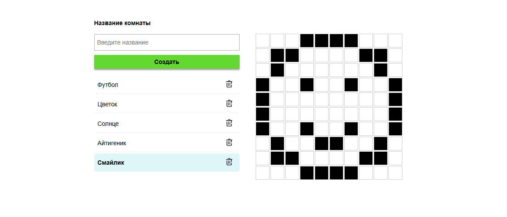

# 🏗️ Meteor Room Grid App

Приложение на базе **Meteor + React + TypeScript** для рисования на холсте, каждый холст содержит 10×10 интерактивную сетку. Проект поддерживает создание, удаление, редактирование состояния сетки и автоматическое сохранение.

---

## 🚀 Возможности

- 🔲 Отображение сетки 10×10 для каждой комнаты
- ➕ Создание новых комнат
- 🗑️ Удаление комнат
- 🧠 Автоматическое сохранение состояния сетки при переключении
- 📦 Работа с MongoDB через Meteor Collections
- ⚡ Мгновенное обновление UI через `useTracker`

